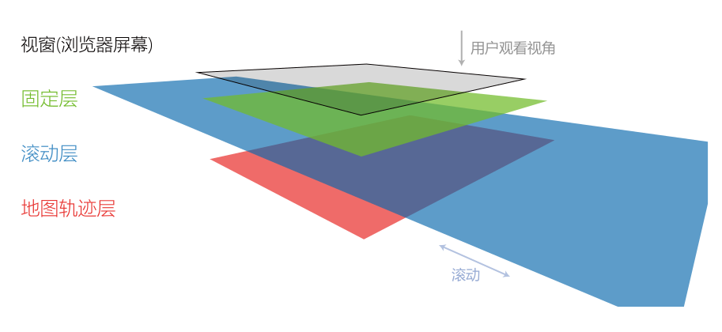
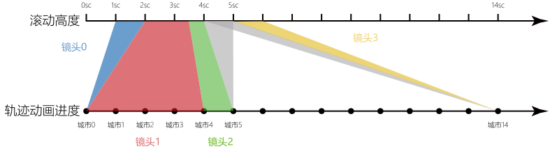

# 古代名人轨迹数据滚动叙述可视化

北京大学数据可视化课程 2022 秋季学期·作业三

## 引言

滚动叙述（Scrollytelling）是一种有趣实用的可视化故事叙述形式，在滚动叙述中，用户简单的滚动页面就能触发不同的音频、视频和动画效果，从而引导故事的推进与展开。现有的滚动叙述的例子包括：

- [Who runs China? - CGTN](https://news.cgtn.com/event/2019/whorunschina/index.html)
- [Exploration of the 1968 Riots in Washington, DC - Washington Post](https://www.washingtonpost.com/graphics/2018/local/dc-riots-1968/)
- [The boat - SBS](https://www.sbs.com.au/theboat/)
- [COVID-19 in Africa - Mo Ibrahim](https://mo.ibrahim.foundation/our-research/data-stories/covid-19-africa-challenging-road-recovery)
- [49 Mile Scenic Route: Explore SF with our new map - PETER HARTLAUB](https://projects.sfchronicle.com/total-sf/49-mile-map/)

在本学期的前两次作业中，我们收集了古代名人的轨迹利用课程网站进行了轨迹可视化，也动手制作了展示名人关系的力导向图可视化。在本次作业中，我们将结合课程提供的滚动叙述模板，制作一个名人轨迹的滚动叙述可视化。
在该模板中，我们基于作业一的轨迹可视化，提供一个滚动叙述可视化模板，模板中提供了地理轨迹动画与滚动事件处理的功能来减轻同学们的工作量。在作业中，同学们需要自己设计编排故事结构，并加入更加丰富的文本，图片，视频和交互式可视化等材料，最终完成一个滚动叙述作品。

**作业示例**：我们在模板中提供了一个以北宋宰相丁谓为数据的作业示例（丁谓在我们的数据库中 id 最小），大家可以在[http://vis.pku.edu.cn/course/datavis_f22/example/hw3/#/](http://vis.pku.edu.cn/course/datavis_f22/example/hw3/#/)网址中查看作业示例的 demo。（推荐使用chrome查看）

**注意**：

- 模板代码使用了[Typescript](https://www.typescriptlang.org/)，文件后缀为 `.ts`，相当于在 `Javascript`的基础上变量加了类型定义与限制的。`Typescript`完全兼容 `Javascript`语法，大家在完成作业时可以完全当作 `Javascript`来编写程序。
- 模板代码多使用 Vue 的组合式 API（ `Vue Composition API`）编写，大家查询[官方文档](https://cn.vuejs.org/guide/introduction.html)时，如果要查看组合式 API 的文档，请在左上角设置打开对应选项。

  

## 准备工作

在开始之前，我们需要使用上次编程课介绍的[Node.js](https://nodejs.org/)为我们的项目配置环境，准备好作业一中收集的人物轨迹 XLSX 文件，同时我们需要对要讲述的故事有一个大概的计划，并收集好相应的文字，图片，视频，或者是交互式可视化图表。

### 下载模板与安装依赖

你可以从课程网站上下载模板的压缩包，或从 github 上下载本模板，由于模板中可能还存在 bug，之后的修正都会更新到本 github 仓库中（同学们可以使用 `merge`命令合并更新后的模板和自己的代码）。
解压文件后，请运行以命令 `npm i`安装依赖，在安装前请确保已经在电脑上安装了[Node.js](https://nodejs.org/)。
运行`npm i`时，可能出现警告信息`WARN`，但只要没有报错`ERR!`，就不影响后续流程的正常进行。

安装完成之后，运行`npm run start`或`npm run dev`，可以启动开发服务器，终端中会出现以下信息，此时在浏览器中打开该地址，可以查看模板中的示例。

```bash
VITE v3.1.3  ready in 274 ms

➜  Local:   http://localhost:5173/
➜  Network: use --host to expose
```

### 轨迹数据准备：

> 注意：目前XLSX中的时间只支持**年份**，请不要写具体的月份与日期。

我们需要用到作业一中的人物轨迹数据，将作业一中的 XLSX 文件重命名为 `trajectory.xlsx`，并将其放在 `public`目录下，我们的代码会自动读取该文件作为人物的轨迹数据。
_更具体地，人物轨迹的读取会在 `src/data/dataloader/poet.ts`中进行，在 `StoryMain`的第 x 行 `getData()`从 `poet.ts`中获取数据。_

### 材料收集与故事设计

我们可以先把收集的文字，图片，音频，视频材料放置在 `public`文件夹之下。注意，这些素材的**体积不应该过大**，否则用户载入网页时下载素材需要花费很久时间，这十分影响网页的观看体验。

在示例中，我们为滚动叙述设置了八幕场景：（位置，自定义行为，轨迹动画三列的含义请在阅读后文后查看）（`sc`表示屏幕高度，`1.5sc`就是指 1.5 倍屏幕高度）

| 序号 | 内容                     | 位置                        | 自定义行为                               | 轨迹动画                                                                               |
| ---- | ------------------------ | --------------------------- | ---------------------------------------- | -------------------------------------------------------------------------------------- |
| 0    | 封面                     | 无                          | 滚动 `0.25sc`时从 `上方`退出。       | 总览                                                                                   |
| 1    | 丁谓画像，简介，诗词     | `1sc`，`1.2sc`，`1sc` | 无                                       | 总览                                                                                   |
| 2    | 出生地介绍               | `2.2sc`                   | 苏州位置地图高亮                         | 滚动区间 `[1.6sc, 2.2sc]`， 轨迹动画 `[0, 0]`，镜头中心 `[0.2, 0.5]`，倍数 `2` |
| 3    | 视频：受人帮助与考取功名 | `3sc`                     | 无                                       | 滚动区间 `[2.2sc, 3.1sc]`， 轨迹动画 `[0, 1]`，镜头中心 `[0.7, 0.5]`，倍数 `2` |
| 4    | 游历全国                 | 无                          | 滚动进度在 `3.4sc`与 `5sc`之间时出现 | 滚动区间 `[3.4sc, 5sc]`， 轨迹动画 `[1, 20]`，倍数 `0.9`                         |
| 5    | 力导向图：社交网络       | `5.7sc`                   | 无                                       | 无                                                                                     |
| 6    | 丁谓逝世                 | `7sc`                     | 信阳位置地图高亮                         | 滚动区间 `[6.2sc, 6.9sc]`， 轨迹动画 `[32, 32]`                                    |
| 7    | 自由探索                 | 无                          | 滚动 `7sc`时从下方出现                 | 无                                                                                     |

## 模板介绍

在模板中，我们主要提供了以下功能，简化从头创作一个有关人物轨迹的滚动叙述可视化的所需的工作：

- 提供了捕捉滚动事件的监听函数。通过这个函数，可以在不同的滚动高度执行不同的动作。
- 提供了轨迹动画。同学们只需准备轨迹数据，并通过指定 `[滚动开始位置，滚动结束位置]`，对应轨迹动画结点段 `[开始事件编号，结束事件编号]`，以及（可选）`镜头中心`和 `镜头缩放倍数`参与，模板会生成轨迹动画。
- 提供可拓展图层的简易地图。可以在地图上增加自定义图形。在示例中，提供了一个支持单地点高亮的图层。
- 加入了[AOS](https://github.com/michalsnik/aos)库，自动添加进入/退出动画。

在使用模板创作故事叙述时，我们主要更改 `src/views/StoryMain.vue`文件以及 `src/userdefine`文件夹，如果需要自定义地图图层（例如在地图上添加高亮，符号，动画等），则可能需要修改 `src/components/map`中的内容。

在介绍模板时，我们会结合作业示例进行讲解。

### 模板框架与滚动监听函数

在本小节中，我们从整体上介绍模板是如何在网页中展示一个滚动叙述的，同时介绍如何修改模板，使得我们定义的内容能随着滚动进入/退出/或进行其他动画。

我们的模板由三层内容组成（如下图所示），分别是**地图轨迹层**、**滚动层**和**固定层**。它们具体的功能如下：



- 地图轨迹层：模板中提供的地图与轨迹动画将被渲染在这一层，在作业中，我们可以不用关心这一层的内容。
- 滚动层：在网页中，我们滚动鼠标实际上操作的是滚动层，滚动层是一个长度远远超过屏幕的长条，其会随着鼠标滚动而移动。在最简单的滚动叙述中，我们只要把文字，图片，视频等内容按顺序放在滚动层即可，用户滚动时，我们会依次看到这些内容。将内容放置在这一层时，你需要设置 `style`中的 `position: absolute;`，同时设置其相对于滚动层的具体位置 `top=200vh; left=50vw;`。
- 固定层：如果你希望一些内容不随着滚动移动，你可以将内容放在这一层，这一层中内容的位置是相对于屏幕是固定的，你需要通过滚动监听函数来控制这些内容行为（例如进入/退出）。

我们可以根据自己的需求将文本，图片，视频，或是交互式可视化加入到**滚动层**与**固定层**。直接编辑对应的html即可。

```html
<template>
  <div class="container story-main" ref="storyMain">
    <!-- 背景的轨迹可视化 -->
    <SinglePersonVue class='story-map'></SinglePersonVue>
    <!-- 故事内容 -->
    <div class="story-content">
       <!-- 滚动层，该div会随着滚动而滚动，像一条传送带，放在上面的内容将被带着向屏幕上方走 -->
      <div class="scroll-belt" :style="{ height: `${scrollScreenNum * 100}vh` }"></div>
      <!-- 该div不会随着故事场景滚动而滚动，放置在上面的内容默认状态下与屏幕保持静止 -->
      <div class="scroll-static"></div>
    </div>
  </div>
</template>
```

当我们滚动层滚动时，我们需要时刻关注当前的滚动高度，以触发一些预先定义的动作。我们定义**滚动高度**为已经滚动到屏幕之上当前看不到的部分的高度，在我们的模板中，滚动高度用 `屏幕高度的倍数`表示，在本介绍中，简写为 `sc`（`2sc`表示 2 倍屏幕高度，`0.3sc`表示为 0.3 被屏幕高度）。在我们的设定之下，大家在 CSS 编程中用 `vh`这一单位会更加方便，`1vh`为屏幕高度的百分之一，即 `1vh`=`1%屏幕高度`=`0.01sc`。

在模板中，我们在屏幕右侧设置了滚动层长度标尺，方便大家读取滚动高度，读取当前滚动高度时，记得是以屏幕上边缘的标尺为准。标尺也能帮助我们确定滚动层内容的位置，在上文的故事设计表格中，**位置**一列为对应滚动层内容的上边缘所在位置。最后提交作业时，记得将标尺代码注释。

```html
<!-- 标尺位置：StoryMain.vue文件中，class为ruler -->
<div class="ruler"></div>
```

在模板中，我们设置了滚动监听函数监测滚动高度的变化。每当滚动高度改变时，监听函数都将被调用一次，该函数有一个参数 offset，表示当前的滚动高度。

```javascript
/*
 * 监听函数watch
 */
const storyMain = ref(null);
watch(scrollController.progress, (offset) => {
    d3.select(storyMain.value).select(".story-content").node().scrollTop = offset;
    prefaceCheck(offset);
    ...
});

```

如果我们希望当滚动高度在某一数值或区间时，执行某些动作，则可以设置**检查函数**并在监听函数中运行**检查函数**，判断这次更新后是否应该执行动作。例如要求一个 `div`在滚动高度 `3.4sc`到 `5sc`之间出现，其他时候消失（第四幕：游历全国），则有以下示例。

```javascript

/**
 * 检查函数：当滚动高度在3.4sc到5sc之间时，让scrollPlsRef指代的
 */
const scrollPlsRef = ref(null);
let scrollPlsState = false;
function scrollPlsCheck(offset) {
    const isInTheRange = offset > window.innerHeight * 3.4 && offset < window.innerHeight * 5;
    // 同时判断区间
    if (!scrollPlsState && isInTheRange) {
        scrollPlsState = true;
        d3.select(scrollPlsRef.value).transition().style("top", '0vh'); //出现，设置位置（相对屏幕）为0sc
    }
    if (scrollPlsState && !isInTheRange) {
        scrollPlsState = false;
        d3.select(scrollPlsRef.value).transition().style("top", '-100vh');//消失，设置位置（相对屏幕）为1sc
    }
}

/*
 * 记得将这个检查函数加到监听watch中
*/
watch(scrollController.progress, (offset) => {
    d3.select(storyMain.value).select(".story-content").node().scrollTop = offset;
    prefaceCheck(offset);
    ...
    scrollPlsCheck(offset);
});

/**
 * 提示：在template的html元素中设置ref="xxx"属性。
 * 然后在script中设置同名变量，即可让该变量绑定到这一html元素
 */
 <div ref="scrollPlsRef"></div>
 const scrollPlsRef = ref(null);

```

> **提醒**：示例中的检查函数行为可以参考上文故事设计表格中的**自定义行为**一列。

### 轨迹动画与镜头控制

为了方便控制**地图轨迹层**的轨迹动画，模板提供了接口设置滚动高度与轨迹的**动画映射**，并支持镜头偏移与缩放的设置。在模板中，对动画的控制表现为一个映射，只需要指定滚动高度区间到轨迹之间的映射关系，模板中的代码会自动地将这一区间内的滚动高度线性映射到对应的动画进度，从而实现滚动时的轨迹动画播放（如下图）。
对于没有指定映射的滚动高度区间，轨迹会保持不动（例如灰色区域），此时会根据是从前面过来还是从后面过来停留在不同的动画进度中。除此之外，也要注意不应该将同一滚动高度区间映射到不同的轨迹上。



**动画映射**在 `StoryMain.vue`中的 `trajectoryAnimation`中定义，以下为上图的对应代码。

```javascript
const trajectoryAnimation = [
  {
    domain: [1, 2],
    range: [0, 0],
    cameraCenter: [0.2, 0.5],
    scaleCompensation: 2,
  },
  {
    domain: [2, 3.5],
    range: [0, 4],
    cameraCenter: [0.7, 0.5],
    scaleCompensation: 2,
  },
  {
    domain: [3.5, 4],
    range: [4, 5],
    scaleCompensation: 0.9,
  },
  {
    domain: [5, 6],
    range: [14, 14],
  },
];
```

`trajectoryAnimation`是一个数组，其中每个元素表示一个镜头，包含四个属性，具体为：

- `domain`：滚动高度区间$[top, bottom]$，表示这段动画应该在滚动高度 $top\  \texttt{sc}$到 $bottom\  \texttt{sc}$之间播放。
- `range`：轨迹区间$[start, end]$，表示播放数据中第$start$个到第$end$个停留事件的轨迹，注意**标号从 0 开始**。
- `cameraCenter`：画面中心在屏幕的位置$[x, y]$。轨迹镜头会自动跟踪到当前播放进度，但你可以用这个参数设置画面中心在屏幕的位置，例如某一时刻，屏幕左半部分是文字材料，你想让画面中心在右边，则可以设置$[0.25, 0.5]$，此时表示画面中心在距离屏幕左上角$0.25$个屏幕宽，$0.5$个屏幕高的位置。
- `scaleCompensation`：镜头缩放倍数补偿（可选，不写默认为 1）。轨迹动画中的基础缩放倍数是自动决定的，但你可以设置这个倍数可对自动倍数进行补偿（乘法）。

除了动画与镜头的控制，在**地图轨迹层**中，还分为**总览模式**和**动画模式**两种模式，使用 `StoryMain.vue`中的 `singlePersonStore.mode`变量控制：

- `singlePersonStore.mode=0`：动画模式。此时按照动画映射设定的行为进行。
- `singlePersonStore.mode=1`：总览模式。当设置为总览模式时，只会展示静态的总览画面，动画映射不会生效，所以请确保你想播放动画时已经进入了动画模式 `mode=0`。

在示例中，第零幕和第一幕都处于总览模式（在 `StoryMain.vue`的 `onMounted`中设置），在滚动超过 `1.5sc`时才进入动画模式，而动画映射都是则总体覆盖了 `1.6sc`到 `6.9sc`，最终在 `7sc`是结束（弹出自由探索界面）。

> **提醒**：示例中的动画与镜头设置可以参考上文故事设计表格中的**轨迹动画**一列。

### 修改地图图层

如果需要更深入地控制**地图轨迹层**，则需要对地图的图层进行修改。我们以模板中设置好了的地图高亮函数为例（**仅支持同时高亮一个点**），介绍图层的使用与定义。

**调用高亮函数**

- `Layers.HighLightWidget.setHighlightPos([115.057764, 32.137578]);`设置高亮地点的经纬度。
- `Layers.HighLightWidget.show();`显示高亮（如果不执行该语句而仅仅设置高亮经纬度，视觉上不会有任何表现）。
- `Layers.HighLightWidget.hide();`隐藏高亮。

例如控制出生地高亮的检查函数为：

```javascript
/*
 * 第二幕：出生-地图高亮控制
 * 高亮苏州[120.59, 31.30]
 */
let birthMapState = false;
function birthMapCheck(offset) {
  const isInTheRange =
    offset > window.innerHeight * 1.6 && offset < window.innerHeight * 2.2;
  if (!birthMapState && isInTheRange) {
    birthMapState = true;
    Layers.HighLightWidget.setHighlightPos([120.59, 31.3]);
    Layers.HighLightWidget.show();
  }
  if (birthMapState && !isInTheRange) {
    birthMapState = false;
    Layers.HighLightWidget.hide();
  }
}
```

**编写新的图层**

_注意，按照以下方法编写的图层都是单实例图层（没有办法初始化两个图层实例），如果有需求自行探索。_

如果我们要新建一个名字叫 `HighLightWidget`的图层（即我们提供的单地点高亮图层），则需要进行以下修改：

- 在 `src/components/map/layers/`中新建一个 `highlightwidget.js`文件。
- 在 `src/components/map/layers/index.js`中，先导入这个图层 `import * as HighLightWidget from "./highlightwidget"";`，然后在 `export`中加入 `HighLightWidget`。
- 在 `src/components/map/MainMap.vue`中以下位置加入注册该图层：

```javascript
if (this.storytelling) {
  //加入你的自定义图层
  Layers.HighLightWidget.register(this);
}
```

- 在 `src/components/map/layers/highlightwidget.js`中编写图层内容，内容中必须包含函数 `register`和若干变量：

```javascript
//图层名称（唯一id）
const name = "highlightwidget";
const layerRef = Symbol(name);
let layer = null;
let vueComponentBelong;

//图层初始化，参数vueComponent是地图组件MainMap
export function register(vueComponent) {
  //在MainMap上加入对应的svg元素
  vueComponent[layerRef] = vueComponent.container.append("g");
  layer = vueComponent[layerRef];
  //在图层中存储MainMap
  vueComponentBelong = vueComponent;
}
```

- 之后我们可以加入更多的函数与变量支持我们的功能，例如绘制图像，控制地图整体缩放等等。可以参考 `src/components/map/layers/highlightwidget.js`中高亮的实现，或 `layers` 中其他图层的实现。

```javascript
//MainMap中的重要函数

//将经纬度坐标映射到svg坐标
vueComponent.projection: ([number, number]) => [number, number]
```

### 使用 AOS 动画

在滚动层中，我们引入了[AOS](https://github.com/michalsnik/aos)库。使得我们只要给滚动层中的内容简单地设置属性 `data-aos='动画方式'`，就能自动给它们加上进入/退出的动画。例如在示例中给第一幕和第三幕中的元素设置了淡入与缩放动画：

```html
<!-- 省略了div的内容和样式代码 -->
<!-- 第一幕 -->
<div class="scrollystory-box" data-aos="fade-right"></div>
<div class="scrollystory-box" data-aos="fade-right"></div>
<div data-aos="fade-left"></div>
<!-- 第三幕 -->
<div class="scrollystory-box" data-aos="zoom-in-left"></div>
```

### 其他设置

- 记得修改网页标题（在浏览器 tab 中显示的文字），请在 `index.html`的 `<title>`标签中更改。
- `StoryMain.vue`中，`scrollScreenNum`设置了滚动层的总长度，记得进行修改，否则右侧的滚动条显示比例会不正确。
- 在示例中，当滚动叙述结束后，如果再向后滑动，会进入完整的轨迹可视化。
  - 如果保留了结尾的完整轨迹可视化，记得在 `src/views/SinglePersonFull.vue`中修改标题。
  - 在 `StoryMain.vue`中，注意处理从完整轨迹可视化返回的函数 `exploreMapOnClick`，返回时建议重设滚动高度，防止返回后马上又触发结束动作。
  - 当用 `d3.json`或 `d3.csv`读取文件时，请将文件放在 `public`文件夹，文件路径请**不要**以 `/`或 `./`开头，这会影响最后在服务器上的部署，请直接以文件或文件夹的名字开始。例如要引入文件 `public/mydata/data.json`，请写作 `d3.json('mydata/data.json').then(...)`。

## 打包

当完成了以上所有的事物，检查了网页正常运行，我们就需要将整个项目打包为一个可部署的网页，以方便最终各位同学的作品被放在课程网站上展示。

运行命令 `npm run build`进行打包操作，等待打包程序执行，打包完后，可部署的网页内容会生成在 `dist`文件夹中。此时，整个`dist`文件夹就是一个可直接部署的网页。我们可以可以将 `dist`文件夹移动到别处，在不用安装 `Node.js`的情况下，就可以直接使用 `python -m http.server`的方法查看滚动叙述网页。
